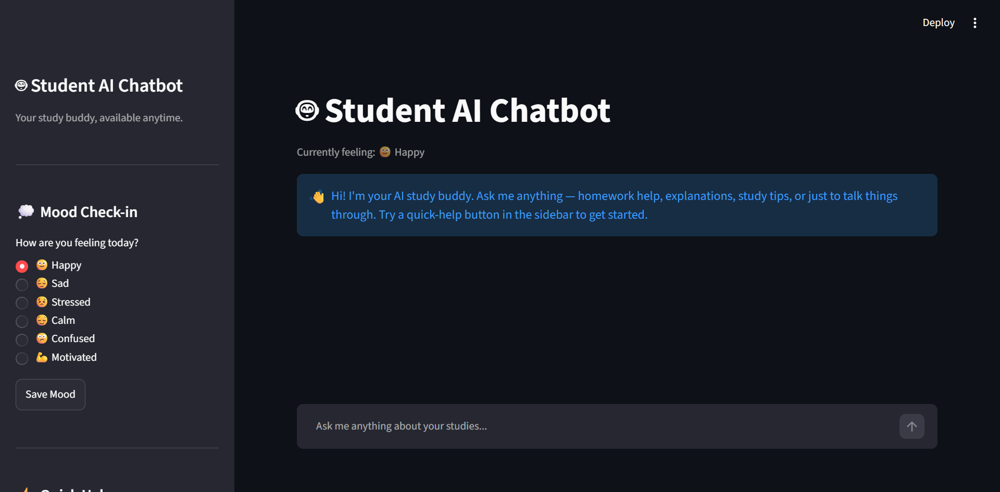
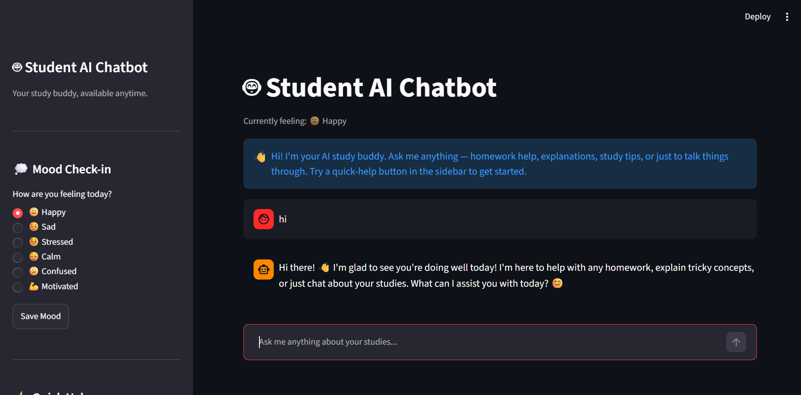
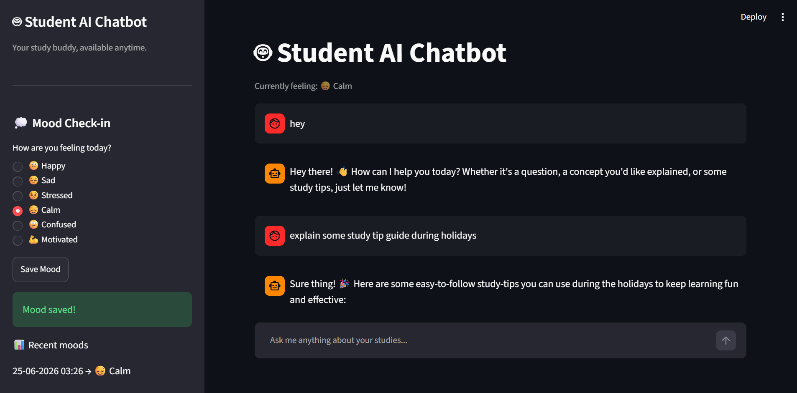
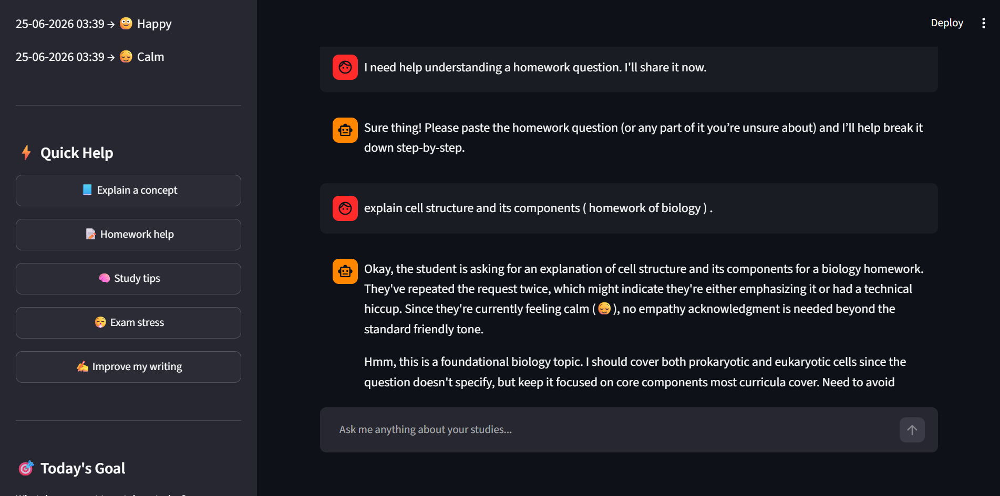

# 🤖 AI-Integrated-ChatBot

An AI-powered Student Study Assistant built with Python, Streamlit, and OpenRouter. The chatbot provides personalized learning support, homework assistance, concept explanations, and mood-aware responses to help students learn more effectively.

---

 ## 🚀 Live Demo

🔗 https://student-ai-chatbot-gituser715.streamlit.app

---

## 🚀 Features

- 📚 Homework Assistance
- 🧠 AI Concept Explanation
- 😊 Mood-Aware Responses
- 💬 Interactive Chat Interface
- 📝 Conversation History
- ⚡️ Fast AI Responses
- 🎨 Clean Streamlit User Interface

---

## 🛠️ Tech Stack

- Python
- Streamlit
- OpenRouter API
- OpenAI Python SDK

---

## 📂 Project Structure

AI-Integrated-ChatBot/
│── app.py
│── requirements.txt
│── .gitignore
│── README.md
---

## ⚙️ Installation

Clone the repository:

git clone https://github.com/YOUR_USERNAME/AI-Integrated-ChatBot.git
Install dependencies:

pip install -r requirements.txt
Create a .streamlit/secrets.toml file:

OPENROUTER_API_KEY="your_api_key_here"
Run the application:

streamlit run app.py
---

## 📸 Demo

### Home Screen

### Chat Interface

### Mood Check-in

### Homework Assistance

---

## 📌 Future Improvements

- Resume Analyzer
- Career Recommendation System
- Skill Gap Analysis
- AI Learning Roadmap
- Interview Simulator
- Voice Interaction
- Multi-language Support

---

## 👨‍💻 Author

MD Arman

Computer Science Engineering Student 
 
GitHub: https://github.com/git-user715

## 📸 Screenshots

### 🏠 Home Page

### 😊 Mood Check-in

### 💬 Chat Interface

### 📚 Homework Assistance

